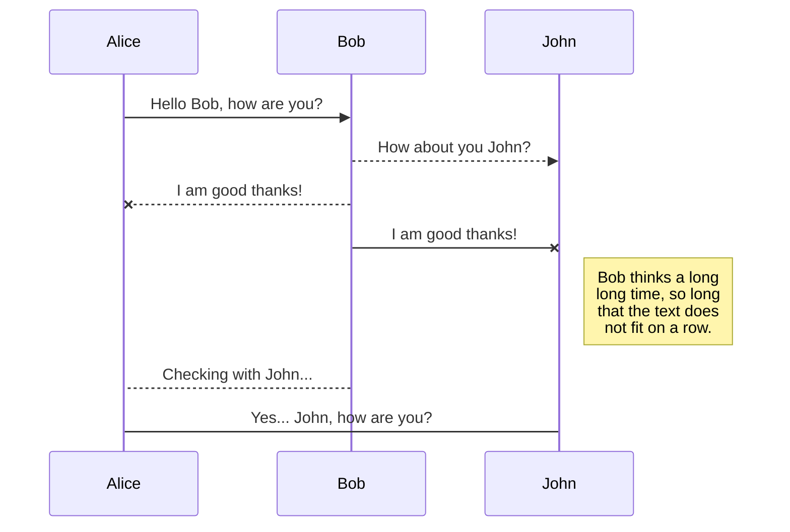
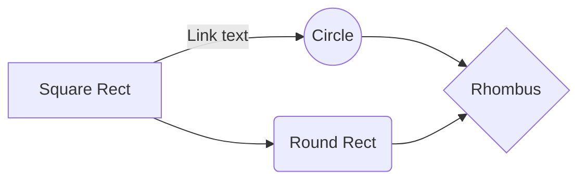

# VacuumMeasurementSystem   

## Complex vacuum measurement and logging system for VIT 2 device   

---

This technical documentation provides information about the VacuumMeasurementSystem which reads ADC sensor data from a device connected to a COM port and calculates the vacuum. The program then saves the data in a `CSV` format and stores it in a database.

## Prerequisites   

To run this program, you need to have the following prerequisites:

- `.NET 6` SDK or higher   
- `System.IO.Ports` NuGet package   
- `Microsoft.EntityFrameworkCore.SqlServer` NuGet package   

## Installation   

1. Install `.NET 6` SDK from the official website: [https://dotnet.microsoft.com/download/dotnet/6.0](https://dotnet.microsoft.com/download/dotnet/6.0)   
2. Create a new `.NET` Console Application project using Visual Studio or the dotnet command line interface.   
3. Install `System.IO.Ports` and `Microsoft.EntityFrameworkCore.SqlServer` NuGet packages by running the following command in the Package Manager Console:

~~~console

Install-Package System.IO.Ports Microsoft.EntityFrameworkCore.SqlServer   

~~~  

4. Download the VacuumMeasurementSystem source code from the GitHub repository: [https://github.com/hattabith/VacuumMeasurementSystem](https://github.com/hattabith/VacuumMeasurementSystem)   

## Program Workflow   

1. The program initializes the COM port connection with the device.   
2. The program reads the ADC sensor data from the device through the COM port.   
3. The program processes the raw sensor data and calculates the vacuum.   
4. The program saves the calculated vacuum data in a `CSV` format.   
5.  The program stores the `CSV` data in a database.   

## Program Components   

The VacuumMeasurementSystem has the following components:   

### 1. Program.cs

This is the main program file that initializes the COM port connection, reads the ADC sensor data, processes it, and saves it in a `CSV` format.   

### 2. AppSettings.json    

This is the configuration file that stores the necessary information for initializing the COM port connection, such as the port name, baud rate, parity, etc.   

### 3. VacuumCalculator.cs

This class contains the logic for processing the ADC sensor data and calculating the vacuum.   

### 4. VacuumReading.cs   

This class defines the structure of the data that is saved in the database.   

### 5. DataContext.cs   

This class contains the logic for connecting to the database and storing the `CSV` data.   

## Usage

1. Connect the device to the computer's COM port.   

2. Open the command prompt/terminal and navigate to the directory where the program is located.   

3. Run the program by executing the following command:   

~~~console
dotnet run
~~~

4. The program will read the ADC sensor data and calculate the vacuum.   

5. The program will save the calculated vacuum data in a `CSV` format and store it in a database.   

## Conclusion   

The VacuumMeasurementSystem reads the ADC sensor data from a device connected to a COM port, calculates the vacuum, and stores the data in a database. The program is written in `.NET 6` and uses `System.IO.Ports` and `Microsoft.EntityFrameworkCore.SqlServer` NuGet packages. This technical documentation provides information about the program's prerequisites, installation, workflow, components, and usage.   

***
<hattabith@gmail.com>

>Project is distributed under MIT license

## KaTeX

You can render LaTeX mathematical expressions using [KaTeX](https://khan.github.io/KaTeX/):

The *Gamma function* satisfying $\Gamma(n) = (n-1)!\quad\forall n\in\mathbb N$ is via the Euler integral

$$
\Gamma(z) = \int_0^\infty t^{z-1}e^{-t}dt\,.
$$

> You can find more information about **LaTeX** mathematical expressions [here](http://meta.math.stackexchange.com/questions/5020/mathjax-basic-tutorial-and-quick-reference).

## UML diagrams

You can render UML diagrams using [Mermaid](https://mermaidjs.github.io/). For example, this will produce a sequence diagram:

And this will produce a flow chart:

